# Architekturdokumentation

## Beschreibung der Systemarchitektur

### Priorisierung der nicht funktionalen Anforderungen

Nichtfunktionale Anforderungen werden vielfach als Randbedingungen und Qualitätseigenschaften verstanden.

> Qualitätsanforderungen

**Änderbarkeit** und **Wiederverwendbarkeit** waren uns besonders wichtig, da wir zu Beginn Schwierigkeiten hatten, uns einen Überblick über den bestehenden Code zu verschaffen. Aus diesem Grund entschieden wir uns, den Code noch einmal von Grund auf neu zu erstellen.
Dadurch verbessert sich vor allem die **Brauchbarkeit** und **Wartbarkeit** des Codes.

> Anforderungen an Lieferbestandteile

Eine vollständige Dokumentation in Form eines PDF Dokumentes und die Software bilden die Lieferbestandteile.

> Anforderungen an die Benutzerschnittstelle

Eine weitere wichtige nicht funktionale Anforderung ist die **Bedienbarkeit** oder **Benutzerfreundlichkeit** des Programms. Da diese Anwendung für eine sehr große Menge an Benutzern ausgelegt ist, wurde die Bedienbarkeit und Benutzerfreundlichkeit des Programms auf eine höhere Priorität gesetzt. So wird gewährleistet, dass Benutzer aller Altersgruppen gut mit der Anwendung interagieren können.

### Architekturprinzipien

> Nach welchen Kriterien soll das System in Komponenten unterteilt werden?
> Wie sollen Komponenten strukturiert und verfeinert werden?

Das System wurde in verschiedene Komponenten unterteilt, die sich jeweils auf eine bestimmte Aufgabe beziehen, um eine enge Kopplung der Module untereinander zu reduzieren.
Der verschachtelte Aufbau der UI Komponenten bildet eine Struktur, die leicht erweitert werden kann.

> Welche Aspekte sollen in Komponenten zusammengefasst werden?

In der `ATM.java` Klasse werden die Änderungen von einem Modus in den Nächsten behandelt.
Dem entsprechend wird die `Screen.java` Klasse angesteuert, um die UI Elemente zu aktualisieren.

Die Klasse `Screen.java` beinhaltet alle Funktionen, die zum Ändern der UI Elemente benötigt werden. In ihr werden die Klassen `Keypad.java` und `SidePanel.java` verwendet.

> Welche Dienstleistungen sollen Komponenten nach außen an ihrer Schnittstelle anbieten?
> Wie sollen die Komponenten miteinander interagieren?

Die Komponente `Keypad.java` gibt über das `KeypadListener.java` Interface alle Events für Tastendrücke an die `Screen.java` Klasse weiter.
Die Komponente `Screen.java` gibt über das Interface `ATMListener.java` Events wie z.B. einen Modus-Wechsel oder das Betätigen der Enter-Taste an die `ATM.java` Klasse weiter.

### Schnittstellen

Hier werden alle Schnittstellen des Systems beschrieben.

- UI mit den Java-Swing GUI Bibliotheken
- `KeypadListener.java` für Kommunikationsschnittstelle zwischen dem Tastenfeld und dem Bildschirm Objekt
- `ATMListener.java` ist die Schnittstelle zum Haupt-ATM-Objekt, in der Aktionen, wie ein Wechsel in einen anderen Modus oder das Betätigen der Enter-Taste behandelt werden

### Big Picture der Systemarchitektur

Der Aufbau der Systemarchitektur ist weitestgehend modular gestaltet und ist hier in einem Klassendiagramm dargestellt.

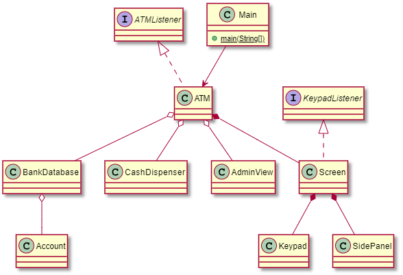
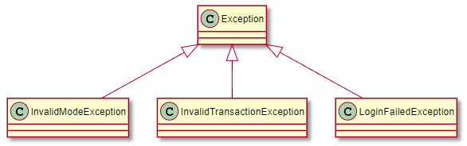

## Systementwurf

### Systemdekomposition

Im folgenden Abschnitt werden die einzelnen Komponenten des Systems und ihre Funktionen beschrieben.

Das System lässt sich hauptsächlich durch die Bestandteile `Guthaben anzeigen`, `Geld abheben` und `Geld einzahlen` beschreiben. Zusätzlich gibt es ein `Menü` eine `Admin-Ansicht` und eine `Login`, sowie eine `Logout` Funktion.

Vom Menü aus, ist es einem Benutzer möglich alle relevanten Funktionalitäten durch das Drücken einer Zahl zu erreichen. Die Funktion `atmSwitchModeAction()` wechselt nun, je nach eingegebener Zahl, in den entsprechenden Modus. Eine weitere wichtige Komponente des Systems ist das `Keypad`, welches die verschiedenen Knöpfe darstellt. Dieses befindet sich immer in der linken Hälfte des Fensters und hilft dem Nutzer bei der Bedienung des Automaten. Es wird in dem Konstruktor der Klasse `Screen.java` zusammen mit dem SidePanel initialisiert.

Das `SidePanel` hat, wie das Keypad, eine eigene Klasse. Es befindet sich auf der rechten Hälfte des Fensters und beinhaltet unter anderem einen „Back-Button“. Mit diesem kann zurück in den „Menü-Modus“ gewechselt werden. In dem SidePanel befindet sich außerdem das Textfeld, in welchem die Benutzereingabe angezeigt wird, sowie ein JLabel. Dieses zeigt, je nach Modus, zum Beispiel das verfügbare Geld, oder die verschiedenen Optionen mit entsprechender Eingabe an.

Eine weitere Funktionalität ist die `Admin-Ansicht`. Loggt sich ein Admin ein, öffnet sich ein neues Fenster. In diesem können die Daten der Benutzer geändert und anschließend gespeichert werden.

### Designalternativen und –Entscheidungen

Es wurde sich dazu entschieden die einzelnen Funktionalitäten mit Hilfe von verschiedenen Modi zu implementieren. Der Bankautomat befindet sich zu jedem Zeitpunkt in einem bestimmten Modus und reagiert, je nach Modus, unterschiedlich auf bestimmte Eingaben. Dieser Ansatz unterscheidet sich von der ursprünglichen Version des Automaten. Hier gab es keine Modi und die verschiedenen Funktionen, wie das Geldabheben, wurden von eigenen Klassen übernommen.

In der alten Version des Bankautomaten, konnte ein Admin mit Hilfe eines Iterators auf die einzelnen Benutzer zugreifen. In dem überarbeiteten Modell ist es möglich, aus einer Liste von Benutzern den gewünschten per Mausklick auszuwählen. Dies ermöglicht eine einfachere und schnellere Bearbeitung.

Zudem wird das Speichern der verschiedenen Benutzer nicht mehr innerhalb einer Java-Klasse übernommen, sondern außerhalb in einer JSON-Datei. Die Benutzerdaten werden mit Hilfe der Klasse `BankDatabase.java` in diese Datei übertragen.

### Cross-Cutting-Concerns, NFRs

Nun werden kurz die Cross-Cutting-Concerns des Systems, sowie der Umgang mit diesen, vorgestellt.

Ein Benutzer soll in jedem Modus eine Eingabe tätigen können. Daher wurde das Keypad und ein entsprechendes Textfeld so implementiert, dass diese Komponenten stets sichtbar und verfügbar sind. Andere Komponenten werden teilweise unsichtbar gemacht, da diese nicht in jedem Modus gebraucht werden.

Ein weiterer Cross-Cutting-Concern ist das Geben von passendem Feedback an den Benutzer. Hier soll dem Benutzer, unabhängig von dem aktuellen Modus, stets mitgeteilt werden, wenn er eine ungültige Eingabe getätigt hat. Für diese Art von Fehlermeldungen wurde im untersten Bereich des Fensters ein Textfeld angelegt, welches die jeweilige Nachricht in roter Farbe anzeigt.

Außerdem ist die Validierung des Inputs bei einem Bankautomaten äußerst wichtig. Deshalb werden die Eingaben stets auf Richtigkeit überprüft. So wird beispielsweise sichergestellt, dass das eingezahlte Geld keinen Maximalwert überschreitet. Ebenso muss sichergestellt werden, dass ein Benutzer nicht mehr Geld abheben kann, als gerade für ihn verfügbar ist.

Bezüglich der Nicht-funktionalen-Anforderungen wurde auf eine hohe Performance und Bedienbarkeit geachtet. Dem Benutzer wird das Bedienen des Automaten durch ein intuitives Interface leichtgemacht. Die Wartezeiten sind kurz, da die Funktionen zur Berechnung von Überweisungen und Kontoständen eine geringe Laufzeit aufweisen.

## Mensch-Maschine-Schnittstelle

### Anforderungen an die Mensch-Maschine-Schnittstelle

Die Mensch-Maschine-Schnittstelle, oder auch Benutzerschnittstelle, bezieht sich auf die Kommunikation zwischen einem Nutzer (Mensch) und dem Geldautomaten (Maschine).
Der Mensch gibt mit seinen Aktoren (Händen) eine Eingabe-Information an die Peripherieeinheiten des Geldautomaten, welche eine digitale Information an die Recheneinheit des Geldautomaten weiterleiten. Die von der Recheneinheit entgegengenommene Information wird mittels der aufgespielten Software verarbeitet und eine Ausgabe-Information wird erzeugt. Die Recheneinheit steuert digital die Peripherieeinheiten des Geldautomaten an, welche eine optische (Bildschirm-Ausgabe) und mechanische Ausgabe Information (Geldauszahlung) erzeugen. Die Rückgabe-Informationen werden vom Menschen visuell (Bildschirm-Information) und haptisch (Annahme des ausgezahlten Geldes) verarbeitet.

| Ein-/Ausgabe | **Mensch Schnittstelle** | **Hardware Schnittstelle**                | **Software Schnittstelle** |
| ------------ | ------------------------ | ----------------------------------------- | -------------------------- |
| **Eingabe**  | Hände                    | Encrypting PIN Pad                        | Tastenabfrage              |
|              | Augen                    | ID-Kartenleser, Softkeys oder Touchscreen | Touchbildschirm Abfrage    |
| **Ausgabe**  | Hände                    | Bildschirm                                | Grafikausgabe              |
|              | Augen                    | Auszahlmodul                              | Peripherie Ansteuerung     |

### Gestaltungsprinzipien

Gestaltungsprinzipien bzw. Gastaltungsgesetze je nach Literatur, helfen ein ansprechendes und verständliches Design zu erstellen.
Es sind psychologische Ansätze, wie das menschliche Gehirn visuelle Informationen wahrnimmt und ordnet. Folgende Prinzipien wurden in diesem Projekt beachtet:

#### Benutzeransicht

> **Prinzip der Ähnlichkeit**

Elemente die ähnliche bzw. gleiche Funktionen haben wurden gleich gestaltet. Wie zum Beispiel die Eingabe Tastenfeld Null bis Neun. Diese haben alle das gleiche Design. Die Tasten “Enter”, “Clear” und “OK” haben das gleiche Design, aber führen unterschiedliche Funktionen aus.

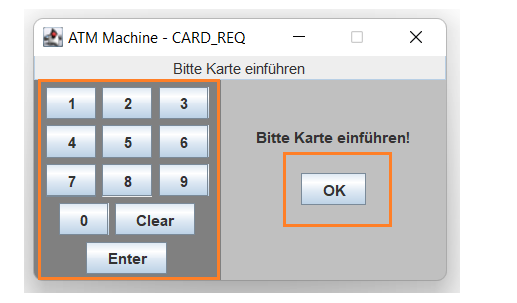

> **Prinzip der Nähe**

Elemente, welche die gleichen Funktionen ausführen, oder helfen, dass diese Funktion ausgeführt werden können, wurden räumlich nah platziert. Wie zum Beispiel die Tasten Null bis Neun. Sie wurden nah aneinander, links im Display platziert. Auch die Knöpfe “Enter” und “Clear” wurden im Tastenfeld platziert, da sie die Eingabe bestätigen oder löschen.

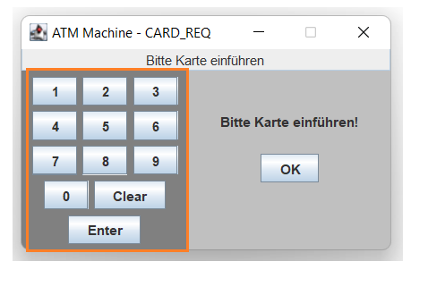

> **Prinzip der Prägnanz**

Interaktionselemente wurden hervorgehoben. Wie im Falle der Eingabeknöpfe Null bis Neun. Aber auch das Ausgabefenster wurde quadratisch und mit weißem Hintergrund gestaltet.

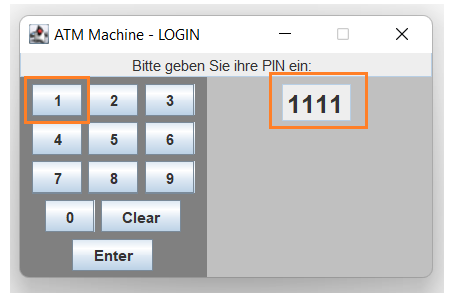

> **Prinzip der gemeinsamen Region**

Eingabe Elemente werden links vom Display platziert und das Ausgabe-Fenster rechts vom Display. Die Regionen sind mit einer unterschiedlichen Hintergrundfarbe optisch getrennt.

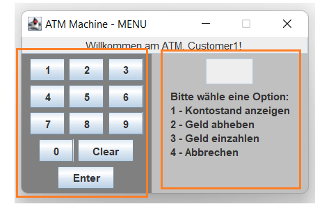

> **Prinzip der Erfahrung**

Elemente werden so gestaltet, wie sie sich zuvor in der Praxis schon bewiesen haben, oder es aus kultureller Sicht angenommen wurde. In unserem Fall wurde kulturell standardisiert, dass numerische Tastenfelder in einer 3x4 Matrix angeordnet werden.

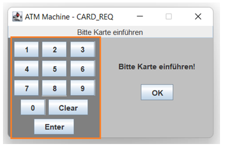

#### Admin-Ansicht

> **Prinzip der Ähnlichkeit**

Elemente, die ähnliche bzw. gleiche Funktionen haben, wurden gleich gestaltet. Wie zum Beispiel die Buttons „Neuer Account“, „Account löschen“ und „Speichern“, die alle benötigt werden um Accountmanagement auszuüben. Die Eingabefelder zum Erstellen neuer Accounts wurden ebenfalls gleich gestaltet.

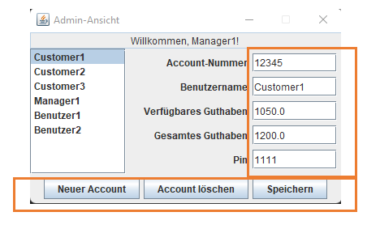

> **Prinzip der Nähe**

Elemente, welche die gleichen Funktionen ausführen, oder dazu helfen, dass diese Funktion ausgeführt werden können, wurden räumlich nah platziert. Die Buttons für das Accountmanagement wurden alle unten platziert. Die Eingabefelder zum Erstellen eines neuen Accounts wurden alle rechts am Bildschirmrand zusammengefasst und die Auswahl eines Kunden an der linken Seite des Bildschirmrandes.

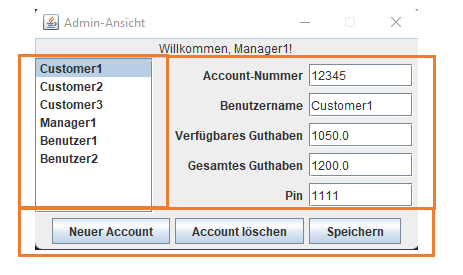

> **Prinzip der Prägnanz**

Interaktionselemente wurden hervorgehoben. Die Buttons wurden bläulich gefärbt und umrandet, um sie hervorzuheben. Ebenso wurde bei der Auswahl eines Kunden, die Auswahl bläulich hinterlegt um zu markieren, welcher Kunde ausgewählt wurde. Zusätzlich wurden die Eingabefelder alle mit weißem Hintergrund versehen.

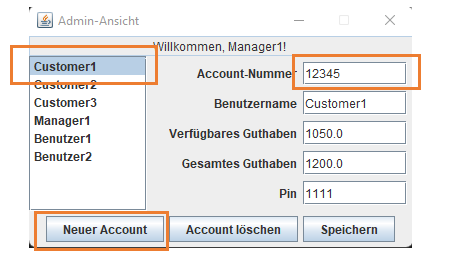

> **Prinzip der gemeinsamen Region**

Die Auswahl der Kunden befindet sich rechts am Bildschirm und die dazugehörigen Daten werden links im Bildschirm angezeigt. Die verfügbaren Optionen wurden unten am Bildschirmrand platziert.

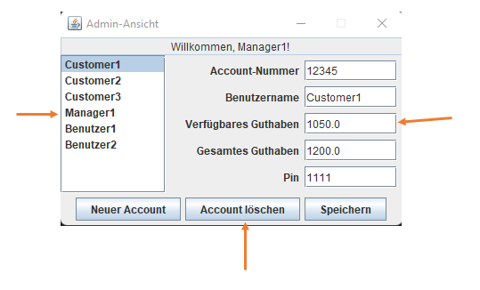

### Styleguide

Im Folgenden wurden Design-Mockups erstellt, welche die Ansichten für den Benutzer und den Administrator repräsentieren.

#### Mockup für die Standardansicht des Automaten

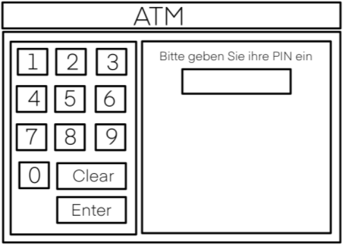

#### Mockup für die Administratoransicht des Automaten

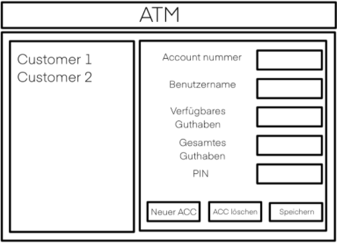

### Interatkionsmodellierung

Im Folgenden wurde die Interaktion zwischen den Benutzern und dem Geldautomaten modelliert und in einem UML-Aktivitätsdiagramm
dargestellt.

#### Admin-Ansicht

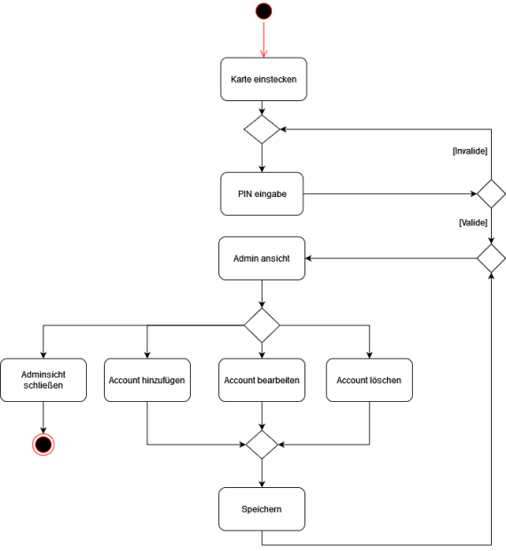

#### Benutzeransicht

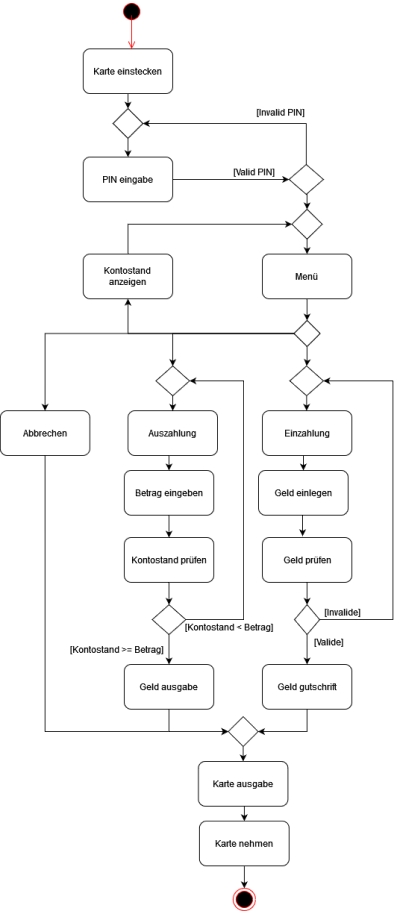
